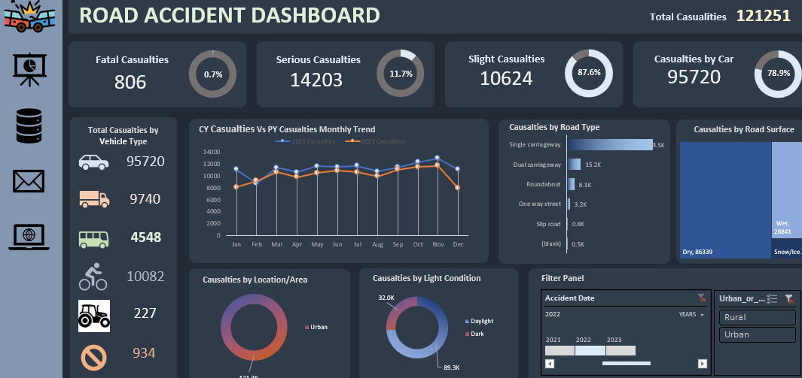

# 🚀 Data Visualization Portfolio

## Road Accident Insights Dashboard

Welcome to my Data Visualization Portfolio! 📊 This repository is a showcase of my passion for turning raw data into actionable insights, featuring a standout project:

### Project Overview

The **Road Accident Insights Dashboard** is not just a visualization tool; it's a journey through the data landscape of road accidents. 🛣️ Gain deep insights into casualties, vehicle types, and more with engaging visuals and intuitive navigation.

### 📸 Project Snapshot

### 🌟 Key Features

- **Causalities as KPI:** Dive into the impact with a detailed breakdown of casualties, covering fatal, serious, and slight incidents.
  
- **Interactive Visualizations:**
  - **Vehicle Types Breakdown:** Visualize accident data based on different vehicle types.
  - **Monthly Trends Exploration:** Ride the waves of accidents month by month.
  - **Road Type Rundown:** Explore incidents on various road types, from single carriageways to roundabouts.
  - **Surface Area Insights:** Discover accidents based on different road surface conditions.
  - **Urban-Rural Area Analysis:** Understand the distinctions between accidents in rural and urban landscapes.
  - **Light Condition Breakdown:** Illuminate accident scenarios with insights on daylight and dark conditions.

### 🚀 How to Explore

1. **Download the Dashboard:**
   - Find the Excel file [here](Road Accident Data.xlsx).

2. **Navigate Through Sheets:**
   - Open the Excel file and take a journey through sheets with engaging visualizations.
   - Leverage the right panel for smart filtering based on years and areas.

3. **Direct Navigation:**
   - Effortlessly move between sections using intuitive icons.

Feel free to dive into this project and reach out for any questions or collaboration. Thank you for considering my portfolio! 🙌✨
